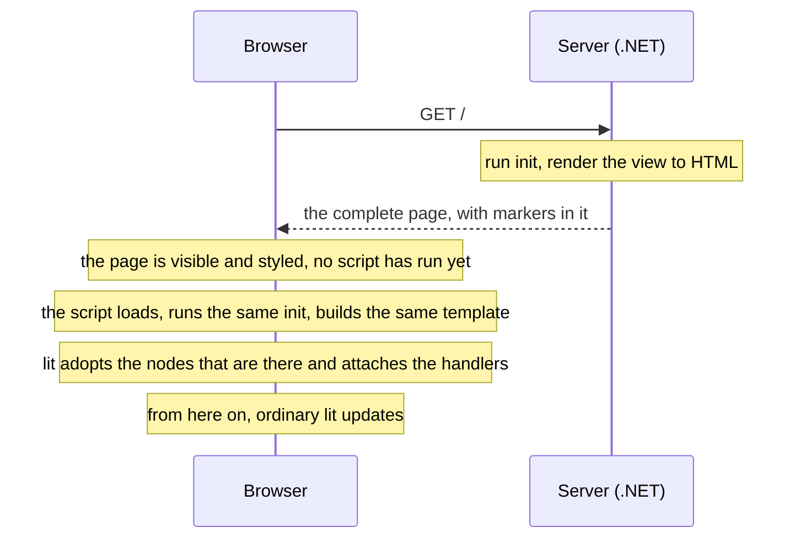
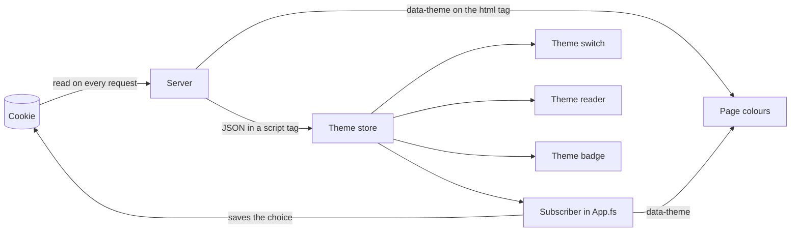

# Fable.Lit: server hydration + View Transitions

**[Try the live demo →](https://litdemo.novian.works)**


https://github.com/user-attachments/assets/58971b1d-48a0-4a2a-9371-1a89bdc73131


> The video is older than the page. It was recorded before the shelf card existed and
> before the server rendered the theme badge. This README describes the page as it is now.

A small demo of server-side rendering in F# with [Fable](https://fable.io) and
[lit](https://lit.dev). In short:

1. You write each view **once** in F#, in the Elmish style (model, update, view).
2. ASP.NET renders it to HTML, so the page is complete before any JavaScript runs.
3. In the browser, lit **adopts** that HTML: it keeps the DOM the server sent and
   attaches event handlers and state to it, instead of building the page a second time.
4. After that, every update is animated with the browser's View Transition API.

There is no Node on the server and no `@lit-labs/ssr`. Node is only used to bundle the
client at build time.

## How to read this

- [The one idea](#the-one-idea) explains the whole demo in two minutes. If you read one
  section, read that one.
- [The tour](#the-tour-seven-lessons) is seven short lessons, one for each thing the page
  shows. Each builds on the one before, and each has something to try in the browser
  console.
- The [cheat sheet](#cheat-sheet) says which function to use for which job.
- The rest is reference: [View Transitions](#view-transitions),
  [working on the code](#working-on-it), [Docker](#running-it-in-docker),
  [what it does not do](#what-it-does-not-do), [packages](#packages) and the
  [words used](#words-used-in-this-readme).

## Run it

You need the .NET 10 SDK and Node.js.

```bash
dotnet run --project Server
```

Then open <http://localhost:5199>. That is the whole setup: building the server also
installs the npm packages (the first time) and compiles and bundles the client.

To work on it with hot reload, see [Editing it while it runs](#editing-it-while-it-runs).

## The one idea

**The server renders the page. The browser adopts it.**



The two sides can agree because they run the same code. `Shared/Views.fs` is compiled
twice: by .NET for the server, and by Fable for the browser.

### What the server actually sends

This is the counter card as it leaves the server (only the indentation is tidied):

```html
<div id="counter">
  <!--lit-part jSJNQadhWNA=-->
  <section class="card">
    <h2>Counter</h2>
    <p>Value: <b class="value"><!--lit-part-->0<!--/lit-part--></b></p>
    <!--lit-node 5--><button>&minus;</button>
    <!--lit-node 6--><button>+</button>
  </section>
  <!--/lit-part-->
</div>
```

It is ordinary HTML with a few comments in it. The comments are notes for lit:

- `<!--lit-part-->` and `<!--/lit-part-->` mark a place where a value goes. The outer pair
  wraps the whole view, and the inner pair wraps the number. The code in the first one
  (`jSJNQadhWNA=`) is a fingerprint of the template.
- `<!--lit-node 5-->` says "the next element has something to attach", here a click
  handler. A function cannot be written into HTML, so the server leaves a note in its
  place.

When the script loads, lit does not build any of this again. It makes the same template
on its side, checks the fingerprint, and follows the comments to the nodes that are
already there. Then it attaches the handlers and remembers where each value lives. From
then on it updates the page the usual way.

That takeover is called **hydration**. This README mostly says **adopt**, because that is
what happens to the nodes: they are kept, not replaced.

### The one rule

> **The browser's first render must be the render the server made: the same template,
> from the same data.**

Break the first half and lit notices. The fingerprints differ, so lit's `hydrate` throws
part way through. `Hydrate.adopt` catches that, prints a console warning that starts with
`lit could not adopt`, and renders from scratch. You lose the saving, not the page.

Break the second half and nothing notices. The page hydrates without complaint and then
shows values the server never sent.

So every card on the page is, underneath, a way of getting the same data to both sides:

| Where the data comes from | Cards | How both sides get the same data |
|---|---|---|
| Both sides can work it out | Counter, Basket, Palette, Panel, Shelf | They run the same `init`. Elmish is plain F#, so it compiles for both. |
| Only the server knows it | Theme switch, Theme reader, Theme badge | The server writes it into the page, and a store reads it once. |
| A parent hands it over | The meter inside the shelf | The component waits until its parent has hydrated. |

## The tour: seven lessons

The page has eight cards. The two theme islands share a lesson, so there are seven. They
are taken in the order that builds up, which is almost the order on the page (the theme
switch sits at the top of the page, and comes fifth here).

| | Card | What it teaches |
|---|---|---|
| [1](#lesson-1-counter-one-view-compiled-twice) | Counter | One view compiled twice, and how to tell it was adopted |
| [2](#lesson-2-basket-islands-do-not-know-about-each-other) | Basket | Several programs on one page that do not know about each other |
| [3](#lesson-3-palette-an-island-inside-a-shadow-root) | Palette | The same thing inside a shadow root |
| [4](#lesson-4-panel-a-frame-with-slots-and-knowing-when-an-element-leaves) | Panel | A shadow root used as a frame, and knowing when an element leaves |
| [5](#lesson-5-theme-state-only-the-server-knows) | Theme switch, Theme reader | State only the server knows, shared through a store |
| [6](#lesson-6-theme-badge-a-real-component) | Theme badge | A real lit component, rendered by the server |
| [7](#lesson-7-shelf-a-component-inside-an-island) | Shelf | A component inside an island |

Each lesson is laid out the same way: **what you see**, **the idea**, **the code**,
something to **try**, anything to **watch out** for, and a one-line takeaway.

> **About the console snippets.** Type them one line at a time. A click on the page is
> animated, so its result arrives a moment later. Paste a whole block at once and the
> later lines run too early.

### Lesson 1. Counter: one view, compiled twice

**What you see.** A number and two buttons. The card is on the page before any script
has run. The buttons start working when the script arrives.

**The idea.** `Shared/Views.fs` is compiled by two compilers:

- by .NET, against [`Lit.Server.Unofficial`](https://www.nuget.org/packages/Lit.Server.Unofficial), to render HTML on the server;
- by Fable, against [`Fable.Lit.Unofficial`](https://www.nuget.org/packages/Fable.Lit.Unofficial), to run in the browser.

Both packages provide the same `Lit` namespace, and a project references one or the
other, never both. So there is no `#if` in the views, and no template written twice in
two languages.

Elmish is plain F# with no browser code in it, so `init` and `update` compile on both
sides too. The server calls the same `init` the browser will call, and renders from the
same starting model. Nothing has to be sent as JSON.

**The code.** One view, used from both sides:

```fsharp
// Shared/Views.fs: written once
let view model dispatch =
    html
        $"""<section class="card">
              <h2>Counter</h2>
              <p>Value: <b class="value">{model.Count}</b></p>
              <button @click={Ev(fun _ -> dispatch Decrement)}>&minus;</button>
              <button @click={Ev(fun _ -> dispatch Increment)}>+</button>
            </section>"""
```

```fsharp
// Server/Program.fs: run the same init the browser will, then render
let counter, _ = Views.Counter.init ()
Page().Counter(toHydratableNode (Views.Counter.view counter ignore)).Render()
```

```fsharp
// Client/App.fs: one program, adopting its own container
Program.mkProgram Views.Counter.init Views.Counter.update Views.Counter.view
|> Program.withLitHydrated "counter"
|> Program.run
```

The server passes `ignore` for `dispatch`. Nobody clicks on a server, so the `@click`
handlers are left out of the HTML and become real listeners when lit adopts the markup.

`Page` is the page shell, `Server/page.html`, read by
[`HtmlTypeProvider`](https://github.com/OnurGumus/HtmlTypeProvider). Each rendered view
goes into it as a `Node`, never as a string, so nothing is escaped twice.

In `App.fs` the view is also wrapped so that each update is animated (see
[View Transitions](#view-transitions)). That is the only difference from the three lines
above.

**Try it.**

1. Turn JavaScript off and reload. The card is still there, because .NET rendered it.
   The buttons do nothing.
2. Turn JavaScript back on, reload, and type this in the console:

   ```js
   const button = document.querySelector('#counter button')           // a node the server sent
   document.querySelector('#counter button:nth-of-type(2)').click()   // press +
   document.querySelector('#counter .value').textContent              // "1"
   document.querySelector('#counter button') === button               // true
   ```

   The last line is the proof. You cannot *see* adoption: markup that was thrown away and
   rebuilt looks the same as markup that was kept. But the button is still the very same
   object, so nothing was rebuilt.

**Watch out.**

- **Hydrate the element the server rendered into.** The markers are inside
  `<div id="counter">`, so that is the element to hand over, not the card inside it.
  Start from the card and lit begins inside its own marker and never finds it.
- **Start from the same model.** Here both sides call the same `init`, so they always
  match. [Lesson 5](#lesson-5-theme-state-only-the-server-knows) is about what to do when
  they cannot.

> **Takeaway.** Write the view once and run the same `init` on both sides. Then the
> browser can adopt what the server rendered.

### Lesson 2. Basket: islands do not know about each other

**What you see.** A small table. Remove a row and the total follows.

**The idea.** The basket is a second Elmish program with its own container, its own model
and its own loop. An interactive region like this, rendered by the server and driven by
one piece of client code, is called an **island**. The page is several islands side by
side, and each adopts only its own part of the HTML.

**The code.** The same three lines as the counter, with a different name:

```fsharp
Program.mkProgram Views.Basket.init Views.Basket.update Views.Basket.view
|> Program.withLitHydrated "basket"
|> Program.run
```

The rows are a list (`Lit.ofList`). The server gives each row markers of its own, so lit
adopts the rows one by one.

**Try it.**

```js
const card = document.querySelector('#basket section')
document.querySelector('#counter button:nth-of-type(2)').click()   // press the counter's +
document.querySelector('#basket section') === card                 // true: the basket was not touched
document.querySelector('#basket tbody tr button').click()          // remove a basket row
document.querySelector('#counter .value').textContent              // the counter did not move
```

> **Takeaway.** Each island patches its own DOM and ignores the rest. Adding one costs a
> container in the page and three lines in `App.fs`.

### Lesson 3. Palette: an island inside a shadow root

**What you see.** A card with a dashed border. It uses the same `.card` class as the
counter and the basket, yet it looks different.

**The idea.** A **shadow root** is a sealed part of the DOM with its own styles. Page
styles do not reach in, and its styles do not leak out. The palette is an ordinary Elmish
island. The only difference is that the server delivers it inside a shadow root.

It does that with `<template shadowrootmode="open">`. The HTML parser turns that template
into a shadow root while it reads the page. So the card has its shadow DOM and its styles
before any script runs, and it is still there with JavaScript off.

**The code.**

```fsharp
// Server: styles and markup together, inside the template
.Palette(toShadowRootNode Views.Palette.styles (Views.Palette.view palette ignore))
```

```fsharp
// Client: adopt inside the shadow root, where the markers are
Program.mkProgram Views.Palette.init Views.Palette.update Views.Palette.view
|> Program.withLitHydratedInShadowRoot "palette"
|> Program.run
```

Adoption itself did not need to change. lit finds its place by following comments, and
comments work the same inside a shadow root. The styles sit outside the markers, so they
are neither adopted nor rendered again.

**Try it.**

```js
const root = document.querySelector('#palette').shadowRoot
getComputedStyle(root.querySelector('.card')).borderStyle                 // "dashed": the shadow root's own rule
getComputedStyle(document.querySelector('#counter .card')).borderStyle    // "solid": the page's rule
document.querySelector('#palette .card')                                  // null: the page cannot see inside
```

Then switch the theme and watch the palette change colour with everything else. Its
rules are sealed in, but CSS custom properties such as `var(--ink)` are inherited
*through* a shadow boundary, so the card still picks up the page's colours.

**Watch out.** Adopt the shadow root, not its host element. The markers are inside the
root. `Program.withLitHydratedInShadowRoot` finds the root for you.

> **Takeaway.** A shadow root can arrive in the HTML, styles included. Adopting inside it
> works exactly as it does outside.

### Lesson 4. Panel: a frame with slots, and knowing when an element leaves

**What you see.** A card inside a labelled frame.

**The idea.** The palette put everything inside its shadow root. The panel does the
opposite. Its shadow root is only a frame with **slots** in it. The content stays in the
ordinary DOM, called the **light DOM**, and the slots display it.

```html
<bfb-panel id="panel">
  <template shadowrootmode="open">
    <style>:host { display: block } .frame { ... }</style>
    <div class="frame">
      <header><slot name="title"></slot></header>
      <div class="body"><slot></slot></div>
    </div>
  </template>

  <h2 slot="title">Panel</h2>
  <section class="card">...</section>
</bfb-panel>
```

The parser does the assembly. The template becomes the shadow root, everything after it
stays where it is, and the slots show it in place. No script is needed for any of that.

Which stylesheet applies to what:

- The **frame** is inside the shadow root, so only the shadow root's styles reach it.
- The **card** is light DOM, so the page's `.card` rule styles it, exactly like the
  counter and basket cards.
- `::slotted(h2)` lets the shadow root style a slotted element, but only that element
  itself, not anything inside it.

**The code.**

```fsharp
// Server: the two halves of one element
.Panel(
    Node.Fragment
        [ toShadowRootNode Views.Panel.styles Views.Panel.frame     // the frame
          toHydratableNode (Views.Panel.view panel ignore) ]        // the content
)
```

```fsharp
// Client: adopt on the host element
Program.mkProgram Views.Panel.init Views.Panel.update Views.Panel.view
|> Program.withLitHydrated "panel"
|> Program.run
```

**Watch out.** This time you adopt the **host element**, not the shadow root. By the time
the script runs the `<template>` is gone, because the parser used it to build the shadow
root. What is left of the host's children is the light content, and that is what the
markers wrap. The frame has no values in it, so there is nothing in the shadow root to
adopt.

#### Knowing when an element leaves the page

An island lives in a plain element, and a plain element is never told that it was
removed. Remove `#counter` and its program never finds out.

A tag with a dash in its name is different. The browser treats it as a custom element and
can tell it when it joins and leaves the document. `Client/App.fs` uses that for
`bfb-panel`:

```fsharp
Lit.trackConnection (
    "bfb-panel",
    fun _ ->
        console.log "bfb-panel connected"

        { new System.IDisposable with
            member _.Dispose() = console.log "bfb-panel disconnected" }
)
```

The function runs when the element joins the document. The `IDisposable` it returns runs
when the element leaves. A timer or a socket would be started and stopped in the same two
places.

**Try it.** Open the console and reload. `bfb-panel connected` is already there, from
when the page loaded. Then:

```js
const panel = document.querySelector('#panel')
const panelNext = panel.nextSibling    // to put it back in the same place
panel.remove()                         // logs "bfb-panel disconnected"
panelNext.before(panel)                // logs "bfb-panel connected"
```

These are the browser's own callbacks, not polling, and they are the only notification
of this kind the platform offers. lit uses the same ones for its components. What lit
rendered inside the element is paused and resumed with them, so an element that was only
moved comes back with its state intact.

> **Takeaway.** A shadow root can be just a frame. And if an island needs to know when it
> leaves the page, give its container a tag with a dash in it and use
> `Lit.trackConnection`.

### Lesson 5. Theme: state only the server knows

**What you see.** Two cards. One has a button that switches between light and dark. The
other, further down the page, only reports the theme. Reload and the page comes back in
the colours you left it in, with no flash.

**The idea.** Every card so far starts from an `init` that both sides can run. The theme
cannot work that way. Your choice is stored in a cookie. The browser has that cookie too,
but its script only runs after the page has arrived. If the script worked the theme out,
the page would arrive in the wrong colours and correct itself a moment later. So the
server reads the cookie first, and hands the value to the browser.



The server hands it over twice:

1. **For the eyes.** The very first bytes of the page already carry the theme:

   ```html
   <html lang="en" data-theme="dark">
   ```

2. **For the scripts.** Further down, the same value as data:

   ```html
   <script type="application/json" id="bfb-theme">{"Dark":true}</script>
   ```

A **store** reads that once, at startup. A store is an Elmish loop that is not tied to any
element, so several islands can read the same state. Both theme islands start from the
store. So the model they begin with is the model their markup was rendered from, which is
[the one rule](#the-one-rule), kept by other means. Nothing is fetched afterwards.

**The code.** The store, in `Client/ThemeStore.fs`:

```fsharp
let private init () =
    let start = fromPage () |> Option.defaultValue { Dark = false }
    start, ElmishStore.Cmd.none

let private update msg model = Theme.update msg model, ElmishStore.Cmd.none

let store, dispatch = Store.makeElmish init update ignore ()
```

`fromPage` is the one DOM read: it parses the JSON above. `Theme.update` is a normal
Elmish update function. It lives in the shared file next to the views, so the server
compiles it too. Toggling the theme is `dispatch Toggle`, just as it would be inside a
program.

Notice what the store does *not* take. `Program.mkProgram` takes `init`, `update` **and**
`view` and ties them together. A store takes only `init` and `update` and knows nothing
about rendering. That is what lets two islands share it.

An island is then only a view:

```fsharp
mount "theme-switch" Theme.switch
mount "theme-reader" (fun model _ -> Theme.reader model)
```

`mount` is a few lines in `App.fs`. It adopts the server's markup using the store's
current value (`Hydrate.adopt`), then renders again on every change (`Lit.render`).
Neither island knows the other exists.

Painting the page and remembering the choice is neither island's job. It is one more
subscriber in `App.fs`:

```fsharp
ThemeStore.store
|> Store.subscribeImmediate (fun model ->
    document.documentElement.setAttribute ("data-theme", Theme.name model)
    document.cookie <- $"{Theme.Cookie}={Theme.name model}; path=/; max-age=31536000")
```

Click the switch and four things change together: the two islands, the `data-theme`
attribute on `<html>`, and the cookie.

**Try it.**

```js
document.documentElement.dataset.theme                    // "light" or "dark": set by the server
document.getElementById('bfb-theme').textContent          // {"Dark":false} or {"Dark":true}: what the store started from
document.querySelector('#theme-switch button').click()    // both theme cards follow
document.cookie                                           // "bfb-theme=dark" if it was light: ready for the next request
```

Then reload. The server reads the new cookie, so the page arrives in the right colours.
Try it with JavaScript off as well: the page is still themed correctly, because .NET read
the cookie. Only the switch stops working.

**Watch out.** Put in the page only what the first render needs. Everything else can be
fetched once the page is running. And three things about what you do put in:

- **Keep the type simple.** The model is `Dark: bool`, not a `Light | Dark` union. The
  value travels as JSON and is read back with `unbox`, which only works because a bool
  field looks the same in JSON as in F#. A union or an option would not survive the trip.
  If you need one, write a proper encoder and decoder that both sides compile.
- **Mind the escaping.** If the JSON contained `</script>`, the browser would end the
  script element there and parse the rest as HTML. `System.Text.Json` escapes `<` by
  default, which makes this safe. A serialiser set to "relaxed" escaping would not be.
- **Fail soft.** If the JSON is missing or unreadable, the store logs a warning and starts
  from light. The islands then render over the server's markup instead of adopting it.
  You get a warning and a rebuild, not a broken page.

The store is [`Fable.Store`](https://github.com/davedawkins/Fable.Store). Its commands stay
on the client, which is why the shared `update` returns only a model.

> **Takeaway.** When only the server knows the starting state, write it into the page
> once and let everything that shows it start from there.

### Lesson 6. Theme badge: a real component

**What you see.** A seventh card. It reports the theme too, and has a button that
switches it.

**The idea.** Everything so far is an island: markup the server wrote, adopted by code
that `App.fs` starts. The badge is a **component**: a custom element, written with
`[<LitElement>]`. The browser builds it, and it starts itself.

| | Island | Component |
|---|---|---|
| What it is | A container element, and client code that drives it | A custom element with its own tag |
| Who starts it | `App.fs` | Nobody: it starts itself once its tag is defined |
| Where its state lives | An Elmish model, or a store | Hooks, or a store |
| Told when it leaves the page | No | Yes |
| What the server renders | Its view | Its view, as a shadow root inside its tag |
| How the browser adopts it | `Program.withLitHydrated`, or `Hydrate.adopt` | `Hydrate.elements ()`, once for the page |

**The code.**

```fsharp
[<LitElement("bfb-theme-badge")>]
let ThemeBadge () =
    LitElement.init (fun config -> config.styles <- [ Lit.unsafeCSS Theme.Badge.styles ]) |> ignore
    let theme = Hook.useStore ThemeStore.store
    Theme.Badge.view theme (ViewTransitions.dispatch "theme" ThemeStore.dispatch)
```

`Hook.useStore` (from `Fable.LitStore.Unofficial`) is all it takes to connect the
component to the store. There is nothing to fetch. The store already held the server's
value before the element was created, so the component's first render shows it.

#### The server renders it too

A component function uses hooks, so the server cannot run it. What the server *can* run is
the view the component returns, as long as that view is a plain function in a shared file.
`Theme.Badge.view` and `Theme.Badge.styles` are exactly that. The server writes them into
the component's own tag, as a shadow root:

```fsharp
// Server: fills <bfb-theme-badge>${Badge}</bfb-theme-badge> in page.html
.Badge(toShadowRootNode Theme.Badge.styles (Theme.Badge.view theme ignore))
```

```fsharp
// Client: once, in App.fs
Hydrate.elements ()
```

`Hydrate.elements ()` (Fable.Lit 2.20.0) makes a component that finds a server-rendered
shadow root on itself adopt it on its first render.

[The one rule](#the-one-rule) still applies: the component's first render must match what
the server rendered. Here it does, because both read the same theme. The server reads it
from the cookie, and the component reads it from the store that was filled from the page.

**Try it.** A component has something an island does not: it is told when it leaves and
when it returns.

```js
const badge = document.querySelector('bfb-theme-badge')
const badgeNext = badge.nextSibling                       // to put it back in the same place
badge.remove()                                            // the badge stops listening to the store
document.querySelector('#theme-switch button').click()    // switch the theme while it is away
badge.shadowRoot.querySelector('.theme').textContent      // still the old theme
badgeNext.before(badge)                                   // it listens again, and catches up
badge.shadowRoot.querySelector('.theme').textContent      // the new theme
```

The two theme islands cannot do this. Their subscription is created in `App.fs` and lasts
as long as the page, because a `<div>` has nowhere to clean up. That gap is what
`Lit.trackConnection` fills for `bfb-panel` in
[lesson 4](#lesson-4-panel-a-frame-with-slots-and-knowing-when-an-element-leaves).

**Watch out.** Without `Hydrate.elements ()` the component renders a second copy next to
the server's, and the server's copy does nothing. The console tells you so.

<details>
<summary>Two more pitfalls, with components and stores</summary>

**Reconnecting.** `disconnectedCallback` disposes whatever `useEffectOnce` set up. If
`connectedCallback` does not set it up again, an element that was only *moved* (dragged to
a new position, re-parented by a list re-render) comes back on screen but no longer
updates, with no error. Fable.Lit 2.18.0 fixed this, including inside `useStore`. There it
needed two things: subscribing again, and reading the current value again, because
`subscribeImmediate` hands back the current value as a return value instead of calling
the callback. A component that only subscribed again would update from then on but keep
showing the value from when it left.

**A store with no subscribers disposes itself.** `Fable.Store` tears a store down when its
last subscriber leaves. Here the page-level subscriber in `App.fs` keeps it alive, so the
badge can come and go. A store read *only* by components would be destroyed the moment
the last one disconnects.

</details>

> **Takeaway.** A component can arrive rendered as well. Keep its view and its styles in a
> shared file, write them into its tag on the server, and call `Hydrate.elements ()` once.

### Lesson 7. Shelf: a component inside an island

**What you see.** A card with a level, two buttons, and a row of five cells that fill and
empty as you press them.

**The idea.** This card puts the last two lessons together. The card itself is an island:
an Elmish program adopts it, like the counter. The row of cells is a component,
`<bfb-meter>`, with a shadow root of its own. The island hands it the level.

Both arrive rendered. This is the meter as the server sends it, for level three (markers
left out):

```html
<bfb-meter defer-hydration>
  <template shadowrootmode="open">
    <style>.cell { ... } .cell.on { ... }</style>
    <div class="cells">
      <span class="cell on"></span>
      <span class="cell on"></span>
      <span class="cell on"></span>
      <span class="cell"></span>
      <span class="cell"></span>
    </div>
  </template>
</bfb-meter>
```

That takes two things the earlier lessons did not need: a way to write that shadow root
from inside a view, and the `defer-hydration` mark.

#### 1. Saying what the component draws, from inside a view

In lesson 6 the badge sat directly in the page, so `Server/Program.fs` could fill its tag.
The meter is not in the page. It is inside the shelf's view, and a view is the same code
on both sides. So the view itself has to say what goes into the meter's shadow root:

```fsharp
// Shared/Views.fs, inside the shelf's view
<bfb-meter .level={model.Level}>{Meter.drawn model.Level}</bfb-meter>
```

```fsharp
// Shared/Views.fs, in the meter's own module
let drawn (level: int) = Lit.shadowRoot styles (view level)
```

`Lit.shadowRoot` (Fable.Lit 2.21.0) means two different things, on purpose:

- On the server it writes the component's shadow root into its tag, so the meter arrives
  rendered.
- In the browser it is `Lit.nothing`, because there a component draws its own root.

It has to be the first thing inside the component's tag.

Nothing in `App.fs` mentions any of this. The shelf is mounted like the counter, and the
meter is a component, so it starts itself.

#### 2. Waiting for the island

The island hands the meter its level as a property (`.level=`), and a property is not in
the HTML. A meter that started the moment it was defined would start at level zero and
draw "empty". That is not what the server drew for level three, so
[the one rule](#the-one-rule) would be broken.

So `Lit.Server` marks the meter with `defer-hydration`, which is lit's own attribute for
"not yet". This is what happens, in order:

1. The server renders the shelf and, inside it, the meter's shadow root for level 3. It
   marks the meter `defer-hydration`.
2. The script defines `bfb-meter`. The meter on the page sees the mark and does nothing.
3. The shelf island adopts its markup. In the same pass, lit takes the mark off and sets
   `.level` to 3.
4. Now the meter starts, renders for level 3, and adopts its shadow root.

The mark is written only when the view hands the component a property, and only in markup
that will be hydrated. A component that gets everything from attributes, its own state or
a store, like the badge, does not wait for anything.

**Try it.**

```js
const meter = document.querySelector('bfb-meter')
meter.hasAttribute('defer-hydration')                    // false: the island took the mark off
meter.level                                              // 3: handed over by the island
meter.shadowRoot.querySelectorAll('.cell.on').length     // 3
```

Then view the page *source* (not the inspector) and search for `bfb-meter`. The mark and
the cells are both there, as the server sent them.

#### Saying it once

`Lit.Server` cannot work out which stylesheet a component has. The component is client
code with hooks in it, and the server never sees it. So the stylesheet and the view have
to be paired by hand. The demo does that in one place per component: a small shared
module that uses the same names each time.

- `styles`: the stylesheet, as a string.
- `view`: what the component draws.
- `drawn`: the two together as a shadow root, for a component that sits inside a view.

`Views.Meter` has all three. `Theme.Badge` has the first two, because the badge sits in
the page, where `Server/Program.fs` hands them to `toShadowRootNode` itself.

The element gives `styles` to lit and returns `view`. A view only ever writes
`{Meter.drawn level}`. No view names a stylesheet, so no view can name the wrong one.

**Watch out.** The page is the one place that still passes the styles by hand, in
`Server/Program.fs`. If that ever goes wrong, or a stylesheet is edited on one side only,
nothing breaks. The component arrives looking one way, or unstyled, and changes when its
script loads. Under `npm run dev`, Fable.Lit 2.21.2 says so in the console and names the
component. Production builds stay quiet.

> **Takeaway.** A component inside an island arrives rendered when the view says what it
> draws. If the island hands it a property, it waits for the island.

## Cheat sheet

Which function to use for which job:

| You have | On the server | In the browser |
|---|---|---|
| An island in an ordinary element | `toHydratableNode view` | `Program.withLitHydrated "id"` |
| An island that reads a store and has no program of its own | `toHydratableNode view` | `Hydrate.adopt element view`, then `Lit.render` on each change |
| An island inside a shadow root | `toShadowRootNode styles view` | `Program.withLitHydratedInShadowRoot "id"` |
| A frame with slots around light content | `toShadowRootNode styles frame`, then `toHydratableNode view` | `Program.withLitHydrated "id"`, on the host |
| A component in the page | `toShadowRootNode styles view`, inside its tag | `Hydrate.elements ()`, once |
| A component inside a view | `Lit.shadowRoot styles view`, first thing inside its tag | `Hydrate.elements ()`, once |
| State only the server knows | JSON in a `<script type="application/json">` | A store that reads it once |
| An island that must know when it leaves the page | A container whose tag has a dash in it | `Lit.trackConnection ("tag", handler)` |

And the three ways to keep [the one rule](#the-one-rule):

1. Let both sides run the same `init`.
2. Write the starting state into the page, and start from that.
3. Make a component wait for whoever hands it its data.

## View Transitions

Things to try on the page:

- Switch the theme: the whole page crossfades, including the shadow roots and the badge.
- Remove a basket row: the row disappears and the others slide into place. **Reset
  basket** lets you replay it.
- The counter, palette, panel and shelf animate their changes too.

How it works:

- `Client/ViewTransitions.fs` wraps every user-triggered `dispatch` in
  `document.startViewTransition`. The initial hydration is not animated.
- The browser takes its "after" snapshot when the update callback finishes. The islands
  render synchronously, but the badge and the meter are components and render a moment
  later, so the callback waits for their `updateComplete`.
- All islands share one queue, so quick clicks in different cards run in order.
- If the user prefers reduced motion, or the browser lacks the API, the update just
  happens without animation.
- The CSS in `Server/page.html` gives basket rows their own transition names only during a
  basket transition. A theme transition captures the whole page as one image.

All browser-specific code is in the client project, so the shared views still compile on
.NET.

## Working on it

### Where things are

| File | What is in it |
|---|---|
| `Shared/Views.fs` | The five Elmish islands (Counter, Basket, Palette, Panel, Shelf), and what the meter draws |
| `Shared/Theme.fs` | The theme state, its `update`, the views that show it, and what the badge draws |
| `Client/App.fs` | Starts everything in the browser: one program per island |
| `Client/ThemeStore.fs` | The shared theme store, and the one DOM read that starts it |
| `Client/ThemeBadge.fs` | The component that reads the store |
| `Client/Meter.fs` | The component inside the shelf island |
| `Client/ViewTransitions.fs` | Wraps updates in a view transition |
| `Server/Program.fs` | A minimal ASP.NET app that renders every view into the page |
| `Server/page.html` | The page shell: an `HtmlTypeProvider` template with one container per card |

### Editing it while it runs

```bash
npm run dev
```

This works from a fresh clone; npm installs what it needs first. You get the same page on
the same port, but saved changes reach the browser without a reload and without losing
state. Increment the counter, remove a basket row, edit `Shared/Views.fs`, and the new
markup appears with the count and the basket as you left them.

Three things run:

- **Fable**, watching and compiling the F#;
- **Vite**, serving the compiled client with hot module replacement;
- **the server**, restarted by nodemon when a file it compiles changes.

<details>
<summary>Why it is set up this way (you do not need this to use the demo)</summary>

**The page still comes from ASP.NET.** In dev, the app proxies anything it does not serve
itself to Vite, so the browser sees a single origin. That is `UseSpa` with
`UseProxyToSpaDevelopmentServer`. It is guarded to leave `/` alone: it is terminal
middleware, and unguarded it would answer for the page too, which would bypass the server
rendering this demo is about.

**Vite runs next to the server, not under it.** The usual choice is
`UseReactDevelopmentServer`, which (despite the name) just runs an npm script and waits
for a port, and is what an ordinary app should use. It cannot be used here. Shared views
are compiled into the server, so editing one restarts the server, and a dev server started
by the server would be killed with it. Fable would recompile from cold on every edit and
the browser would be told its dev server had disappeared. So Vite is started separately
and the proxy waits for it, using the overload that takes a task rather than a URL. The
page still renders immediately; only the request for the script waits.

**State survives a hot update.** `Program.withLitHydrated` records the running program on
the element it renders into. A hot update re-runs the module, the module mounts again, and
the second mount finds the first: it stops it, takes its model, and renders. The one line
that opts in is `HMR.acceptSelf()` in `Client/App.fs`, which makes the module accept its
own updates instead of reloading the page.

**A dev server is needed, not just a rebuilt bundle.** Vite gives every version of the
code the *same* copy of lit. Rebuilding a self-contained bundle and importing it again
looks simpler, but the page then holds two copies of lit, and the second is asked to patch
DOM created by the first. That fails with `part._$setValue is not a function` when their
internals are named differently, and leaves two template caches when they are not.

**The server restarts instead of hot reloading.** F# has no hot reload, and shared views
are compiled into the server. A restart takes a few seconds, and it is what makes the
*next* page load render the view you just wrote. It has to happen *after* the browser has
fetched the hot update, because that update is fetched through the app being restarted.
That is what `nodemon --delay` is for.

**Static files are off in dev.** The page asks for `/App.js` and `wwwroot` contains
`app.js`. On a case-insensitive filesystem those are the same file, so the old bundle
would be served, Vite would never be reached, and the page would quietly run the last
build's code.

**Vite's hot-update socket bypasses the proxy.** A socket through the app would drop every
time the app restarts. Vite would take that to mean the dev server is gone and reload the
page.

</details>

## Running it in Docker

The Docker image builds the client and publishes the ASP.NET app with .NET 10. Node is
used only during the build. The container runs as a non-root user on port 8080.

```bash
docker build -t litdemo .
docker run --rm -p 8080:8080 litdemo
```

## What it does not do

- **It does not run components on the server.** `Lit.Server` renders templates. It cannot
  run a `HookComponent` or a `LitElement`, because hooks mean nothing on the server. It
  can render the view a component returns, when that view is a plain function in a shared
  file. That is how the theme badge and the meter arrive rendered.
- **It does not work out a component's stylesheet**, the way `@lit-labs/ssr` does. You
  pass the styles as a string, to `toShadowRootNode` or `Lit.shadowRoot`, and give the
  same string to the component. [Saying it once](#saying-it-once) is how the demo keeps
  that to one place per component.
- **It does not guess.** Directives the server cannot reproduce faithfully, such as
  `styleMap` or `until`, throw an error instead of producing an approximation.

With Elmish the first of these costs less than it sounds. The model does the job of
`useState` and `Cmd` does the job of `useEffect`, so state and effects live in the loop
and the view stays a plain function of the model. That function is the part both
compilers can render.

## Packages

| Package | What it is for |
|---|---|
| `Fable.Lit.Unofficial` | lit bindings for Fable, plus `Hydrate.adopt` and `Hydrate.elements` |
| `Fable.Lit.Elmish.Unofficial` | `Program.withLitHydrated` |
| `Fable.LitStore.Unofficial` | `Hook.useStore`, for components that read a store |
| `Lit.Server.Unofficial` | renders the same templates to HTML on .NET |
| `HtmlTypeProvider` | typed HTML page templates |
| `Microsoft.AspNetCore.SpaServices.Extensions` | dev only: proxies to the dev server |

`Fable.Lit.Unofficial` and `Fable.Lit.Elmish.Unofficial` come from an
[unofficial fork](https://github.com/OnurGumus/Fable.Lit) of
[Fable.Lit](https://github.com/fable-compiler/Fable.Lit), which was last released in 2022.
They are published under `.Unofficial` ids and will be deprecated if the changes land
upstream.

## Words used in this README

| Term | Meaning here | Introduced in |
|---|---|---|
| **Hydrate / adopt** | The browser script takes over HTML the server already rendered, rather than replacing it. | [The one idea](#the-one-idea) |
| **Marker** | A comment the server leaves in the HTML so lit can find its place again. | [What the server actually sends](#what-the-server-actually-sends) |
| **Elmish program** | A model, an `update` function and a `view` function, running as a loop. | [Lesson 1](#lesson-1-counter-one-view-compiled-twice) |
| **Island** | One interactive region of the page: a container element whose content the server rendered and one piece of client code drives. | [Lesson 2](#lesson-2-basket-islands-do-not-know-about-each-other) |
| **Shadow root** | A sealed part of the DOM with its own styles. Page styles do not reach in and its styles do not leak out. | [Lesson 3](#lesson-3-palette-an-island-inside-a-shadow-root) |
| **Light DOM** | The ordinary DOM, outside any shadow root. | [Lesson 4](#lesson-4-panel-a-frame-with-slots-and-knowing-when-an-element-leaves) |
| **Store** | An Elmish loop that is not tied to any element, so several islands can read the same state. | [Lesson 5](#lesson-5-theme-state-only-the-server-knows) |
| **Component** | A custom element with its own tag, written with `[<LitElement>]`. The browser builds it and it starts itself. | [Lesson 6](#lesson-6-theme-badge-a-real-component) |

## Licence

MIT.
